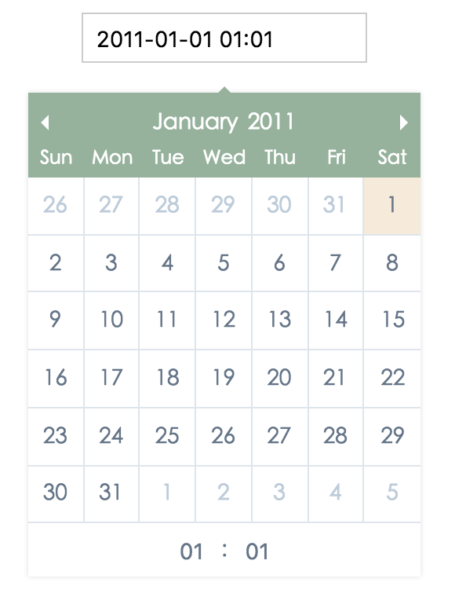

# vuejs-date-picker

Datepicker component for Vue.js, Same as input(type=date) or input(type=datetime)

# Screenshot



# Strong point

The datePicker can be automatically append to body element, So it have no staking level problem and you just write like this :
```
<input type="date" is="date" />
```

# Getting Started

```
<input type="date" is="date" />
```
OR
```
<input type="datetime" is="datetime" />
```

# Installation

```
npm install vuejs-date-picker
```

# APIS

## props

### type

* **date** : It have no input box of time, It accept String type
* **datetime** : It have input box of time, It accept String type

### value

If it is empty, Vuejs-date-picker will set a default date for it

### utc

The default mode is not in utc, Set **true** make date in UTC mode

### format-date

If type prop is date, It will Apply this format, The default format is 'YYYY-MM-DD'

### format-datetime

If type prop is datetime, It will Apply this format, The default format is 'YYYY-MM-DD HH:mm'

### target

It requires a reference to be positioned as the origin, It accepts HTMLElement and String types

### name

Same as native name property

### required

Same as native required property

### focus

When this value is true, It will get the focus, otherwise, It will lose focus, It accept Boolean type

### blur

When this value is true, It will lose the focus, otherwise, It will get focus, It accept Boolean type

## events

### will-open

No event data

It will be triggered when the datePicker will open

### open

No event data

It will be triggered after the datePicker opens

### change

**event data :**

* **date** : The date of the current choose

It will be triggered after the input value is changed

### will-close

**event data :**

* **date** : The date of the current choose
* **isChanged** : Means whether the date has been changed

It will be triggered when the datePicker will close

### close

**event data :**

* **date** : The date of the current choose
* **isChanged** : Means whether the date has been changed

It will be triggered after the datePicker is closed

### flip

No event data

It will be triggered when the datePicker is flipped

### picker-will-destroy

**event data :**

* **date** : The date of the current choose
* **isChanged** : Means whether the date has been changed

It will be triggered when the datePicker will be destroyed

### picker-destroyed

**event data :**

* **date** : The date of the current choose
* **isChanged** : Means whether the date has been changed

It will be triggered after the datePicker is destroyed

### input-will-destroy

**event data :**

* **date** : The date of the current choose
* **isChanged** : Means whether the date has been changed

It will be triggered when the input will be destroyed

### input-destroyed

No event data

It will be triggered after the input is destroyed

# License

[The MIT License](https://opensource.org/licenses/MIT)
